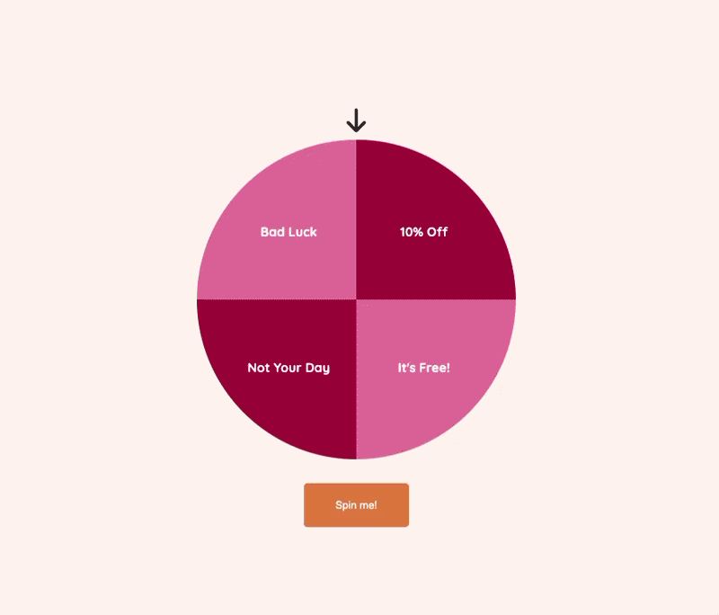

# Spin the wheel! :ferris_wheel:

This repository forms a minimally reproducible example of a 'prize wheel' animation built using vanilla
JavaScript & CSS animations,

<p align="center">
    
</p>

# Usage

To run this, simply:

1. Clone the repository 
2. Set your desired `OPTIONS` & `OPTION_COLOURS` constants in `index.js`,

    ```javascript
    // Constants
    const OPTIONS = [
        "10% Off",
        "It's Free!",
        "Not Your Day",
        "Bad Luck"
    ];
    const OPTION_COLOURS = ["#ad0040ff", "#e77ba3"];
    ```

3. Serve `index.html` using whichever live server addin you have available.

Note that the `index.html` file includes the following custom script,

```html
<script type="text/javascript" src="https://livejs.com/live.js"></script>
```

This enables auto-reload in development, should you wish to 'tinker' with any of the settings.
